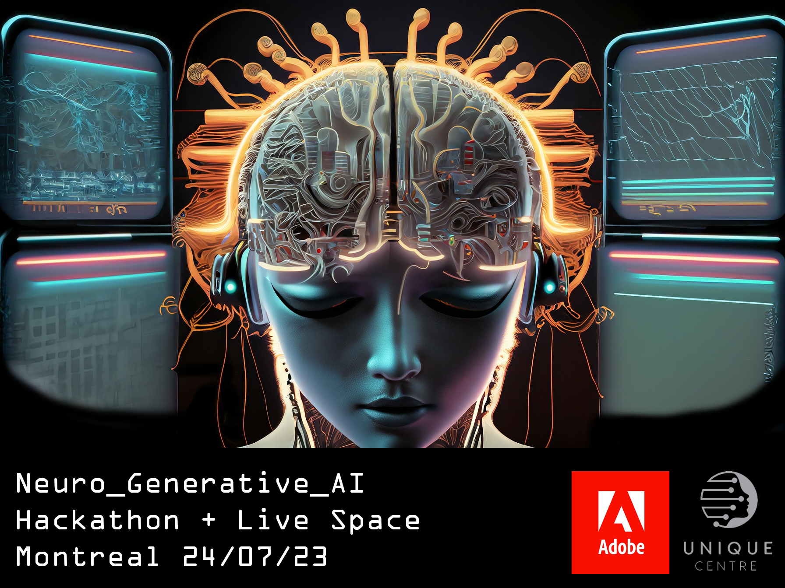

# Welcome to the NeuroAI Creative Hacknight

Come join us at the NeuroAI Creative Hacknight 2023 !

**When:** July 23rd, 2023, from 4 pm to 2 am.

**Where:** 257 Rue Saint-Ferdinand, Montreal, QC H4C 2S6.

**What:** Join us for an electrifying journey where brainwaves, cutting-edge multimodal AI systems, and your sensory perception form an exciting integrative functional network! :-) The event will provide spaces for hacking and geeking around with brain signals, as well as opportunities to experience brain-art installations and live performances, including eeg-inspired live music and DJ/VJ sets. Come immerse yourself in the unique interplay of live-generated poetry, music, and visuals, taking inspiration from your brain state, and maybe some other lifeforms ;)

Curious? find out more on the [program page](https://neuro-ai-creative-hacknight.github.io/program.html) or just sign up to attend!

Registration is free and will remain open until we reach full capaity.  

If you plan on attending, please take 20 seconds to fill in the [registration form](https://docs.google.com/forms/d/e/1FAIpQLSemYF7N-HiEWOe0nOU9_npDHmUvSt0RxOxZCeQqnaOHFf7xfg/viewform)
